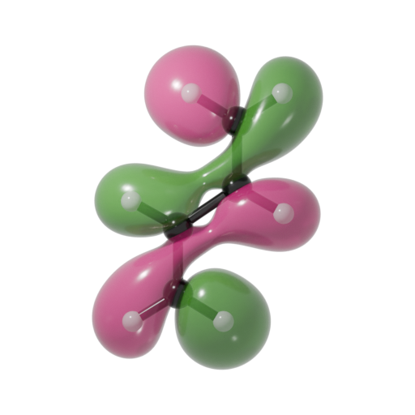
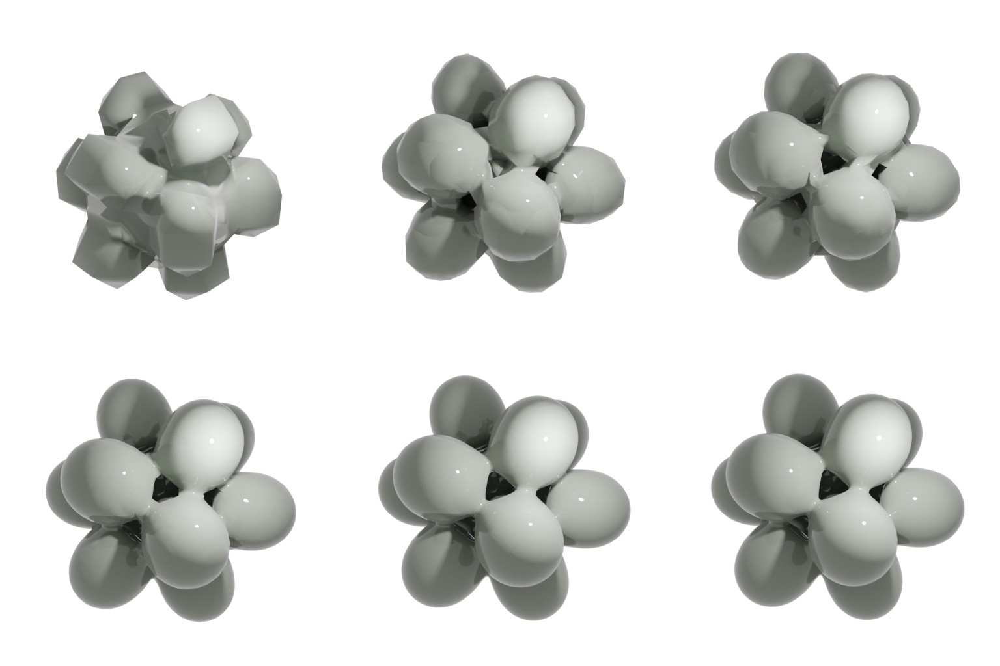
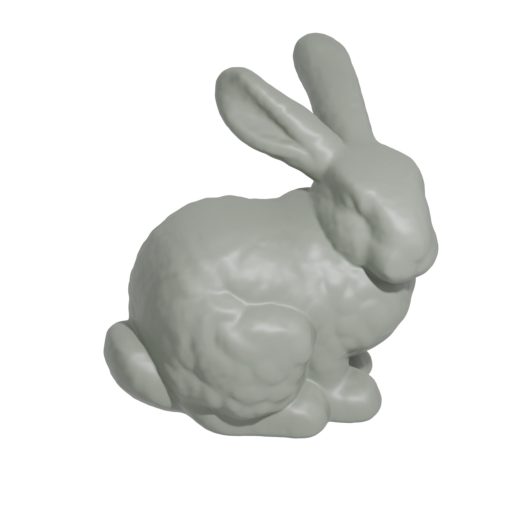

# PyTessel

[](https://github.com/ifilot/pytessel/actions/workflows/build_wheels.yml)
[](https://pypi.org/project/pytessel/)
[](https://pypi.org/project/pytessel/)
[](https://www.gnu.org/licenses/gpl-3.0)

## Purpose

PyTessel is a Python package for constructing isosurfaces from 3D scalar fields
using the marching cubes algorithm. It is designed for scientific visualization,
computational geometry, and mesh generation workflows. While PyTessel was
originally developed for rendering molecular orbitals, it is flexible enough to
tessellate arbitrary scalar fields.



## Installation

```
pip install pytessel
```

## Getting started

The example below constructs an isosurface of a three-dimensional Gaussian function.
The resulting surface is written to `test.ply`, which can be viewed using tools
such as:

* `ctmviewer` (Linux)
* `3D Viewer` (Windows, free via Microsoft Store)
* Blender, MeshLab, etc.

```python
from pytessel import PyTessel
import numpy as np

def main():
    pytessel = PyTessel()

    # Generate a regular grid
    x = np.linspace(0, 10, 50)

    # Grid ordering:
    # z is the slowest-moving index, x is the fastest-moving index
    grid = np.flipud(
        np.vstack(np.meshgrid(x, x, x, indexing='ij')).reshape(3, -1)
    ).T

    R = [5, 5, 5]
    scalarfield = np.reshape(
        np.array([gaussian(r, R) for r in grid]),
        (len(x), len(x), len(x))
    )

    unitcell = np.diag(np.ones(3) * 10.0)

    vertices, normals, indices = pytessel.marching_cubes(
        scalarfield.flatten(),
        scalarfield.shape,
        unitcell.flatten(),
        0.1
    )

    pytessel.write_ply('test.ply', vertices, normals, indices)

def gaussian(r, R):
    return np.exp(-(r - R).dot(r - R))

if __name__ == '__main__':
    main()
```

## Isosurface quality

The script below demonstrates how grid resolution affects surface quality. Six
isosurfaces of an icosahedral metaball are generated using grids of:

* `10×10×10`
* `20×20×20`
* `25×25×25`
* `50×50×50`
* `100×100×100`
* `200×200×200`

Each surface is exported as a .ply file and rendered using [Blender](https://www.blender.org/).

```python
from pytessel import PyTessel
import numpy as np

def main():
    """
    Build 6 .ply files of increasing quality
    """
    pytessel = PyTessel()

    for nrpoints in [10, 20, 25, 50, 100, 200]:
        sz = 3

        x = np.linspace(-sz, sz, nrpoints)
        y = np.linspace(-sz, sz, nrpoints)
        z = np.linspace(-sz, sz, nrpoints)

        xx, yy, zz, field = icosahedron_field(x, y, z)

        unitcell = np.diag(np.ones(3) * sz * 2)
        isovalue = 3.75

        vertices, normals, indices = pytessel.marching_cubes(
            field.flatten(),
            field.shape,
            unitcell.flatten(),
            isovalue
        )

        pytessel.write_ply(
            f'icosahedron_{nrpoints:03d}.ply',
            vertices,
            normals,
            indices
        )

def icosahedron_field(x, y, z):
    """
    Produce a scalar field for icosahedral metaballs
    """
    phi = (1 + np.sqrt(5)) / 2
    vertices = [
        [0, 1, phi], [0, -1, -phi], [0, 1, -phi], [0, -1, phi],
        [1, phi, 0], [-1, -phi, 0], [1, -phi, 0], [-1, phi, 0],
        [phi, 0, 1], [-phi, 0, -1], [phi, 0, -1], [-phi, 0, 1]
    ]

    xx, yy, zz = np.meshgrid(x, y, z)
    field = np.zeros_like(xx)

    for v in vertices:
        field += metaball(xx, yy, zz, v[0], v[1], v[2])

    return xx, yy, zz, field

def metaball(x, y, z, X0, Y0, Z0):
    """
    Single metaball function
    """
    return 1 / ((x - X0)**2 + (y - Y0)**2 + (z - Z0)**2)

if __name__ == '__main__':
    main()
```



## Gallery

### Stanford Bunny



### Gyroid surface

